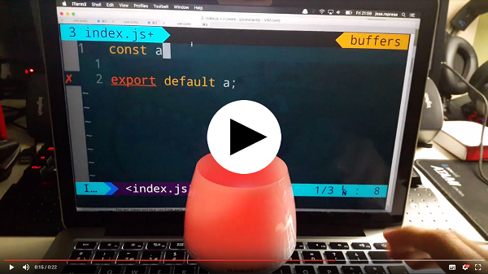
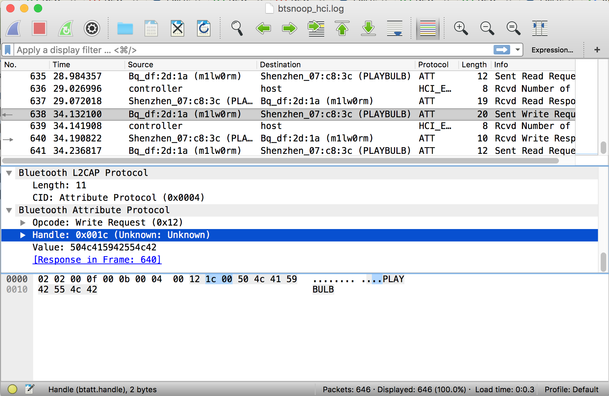

# vim-ale-playbulb

[](https://youtu.be/d3kYVOvJ-o8)

## Preinstall

* Make sure you have `curl`. If you don't have it then install it or customize the `NotifyPlaybulb` vimscript function.
* `nodejs`.
* Compatible USB or Bluetooth device.
* [Playbulb Candle](http://www.playbulb.com/en/playbulb-candle-bluetooth-smart-led-flameless-candle.html) lamp.

# How it works

This repo uses [noble](https://github.com/sandeepmistry/noble) to communicate with a compatible bluetooth device.

Once the server is running, it will try to connect with your **Playbulb Candle** peripheral named `PLAYBULB` (if your device has
a different name then rename it with the Playbulb application or change the name in the code).

When the device has been successfully linked the script turns on an endpoint to allow the color change 
(defaults to `localhost:8723/changeColor`).
This endpoint must be called using a **POST** request and the next 4 params are required:

* `saturation`: Color intensity (from 0 to 1)
* `r`: Red color (from 0 to 255)
* `g`: Green color (from 0 to 255)
* `b`: Blue color (from 0 to 255)

The rest of the work is easy to think how it works, each time the `ale` plugin sends an action, the number of erros/warning
are counted for the current buffer and the color is changed using the previous endpoint.

Thats all folks :)

## Run

First, clone this repo and install all the dependencies:

`$ https://github.com/josex2r/vim-ale-playbulb.git`

`$ cd vim-ale-playbulb && npm i`

Run this command to start the server (if you want to see the log output use the `DEBUG` flag):

`$ npm start`

`$ DEBUG=Express,Candle,Peripheral,Playbulb npm start`

Configure your `~/.vimrc` to send `ale` data to the server:

```
function! NotifyPlaybulb()
  # Get the `ale` error count (includes warnings)
  let l:counts = ale#statusline#Count(bufnr(''))
  let l:errors = l:counts.error + l:counts.style_error
  let l:warnings = l:counts.total - l:errors
  # Set default color (green)
  let l:color = "-d r=0 -d g=255 -d b=0"
  if warnings
    # Yellow
    let l:color = "-d r=255 -d g=100 -d b=0"
  elseif errors
    # Red
    let l:color = "-d r=255 -d g=0 -d b=0"
  endif
  # Send color to the server
  :silent exec "!curl -X POST " . l:color . " localhost:8723/changeColor"
endfunction

# This is the ale notification hook, it will call `NotifyPlaybulb` for each `ale` execution.
augroup VimAlePlaybulb
  autocmd!
  # Call our custom function.
  autocmd User ALELint call NotifyPlaybulb()
augroup END
```

## Interacting with `ale`

Check that you have correctly setup your vim linter with the [ale](https://github.com/w0rp/ale) plugin.
Once you have the pluggin running add this piece of code to your `.vimrc`:

```

```

## Sniffing bluetooth

You can enable this by going to Settings->Developer Options, then checking the box next to 
**"Bluetooth HCI Snoop Log"**.
Once this setting is activated, Android will save the packet capture to `/sdcard/btsnoop_hci.log`
to be pulled and inspected.

Type the following in case `/sdcard/` is not the right path on your particular device:

`$ adb shell echo \$EXTERNAL_STORAGE`

Finding the log file path:

`$ adb shell "cat /etc/bluetooth/bt_stack.conf | grep FileName"`

Retrieve the log

`$ adb pull /sdcard/btsnoop_hci.log`

Inspect it with Wireshark or another tool.

## Checking the Playbulb protocol

[Protocol](https://github.com/Phhere/Playbulb)

The next image shows the packet that change the name of the lamp to "PLAYBULB", check the packet data:

* Address: `0x001c`
* Service: `0xffff`
* Value: `504c415942554c42` (**PLAYBULB**)



